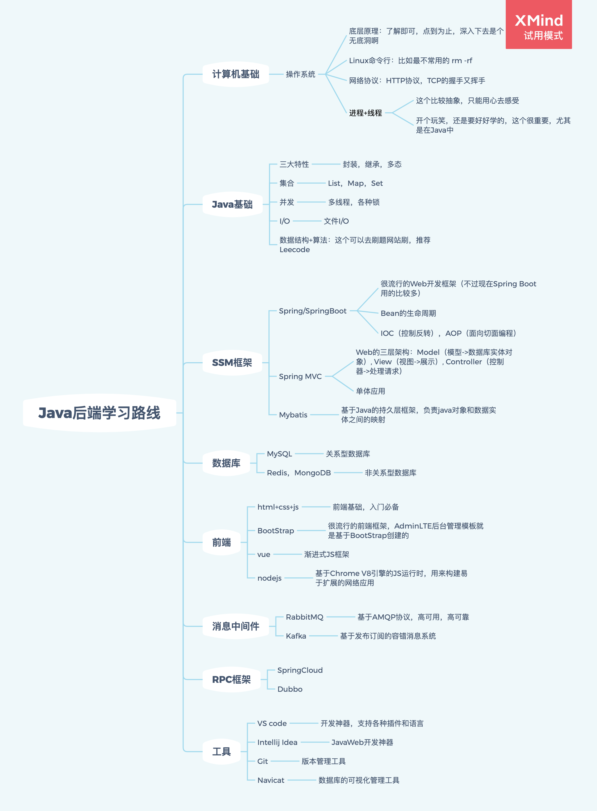

 
  
  
  
  

这里先贴一张后端学习路线

下面的系列文章基本也是按照这个路线来

**文章持续更新，每周两到三篇，欢迎大家关注呦**

# 1. 计算机系列

[TCP/IP协议的经典面试知识点总结](https://mp.weixin.qq.com/s/TDqooFV3f90Qqp2vZBNB1Q)

[进程与线程 - 入门知识篇](https://mp.weixin.qq.com/s/7og_nAEKnkJxmwaroqQtbA)

# 2. Java系列

## 2.1 资源篇

[Java书单-核心篇](http://javalover.cc/archives/java-book-core)

[Java后端学习路线](https://mp.weixin.qq.com/s/D2eBDyFey7J9MUW8Fx7JWA)

## 2.2 基础篇

[Java中的IO流 - 入门篇](http://javalover.cc/archives/java-file-io)

[Java中的集合List - 入门篇](http://javalover.cc/archives/java-collection-list)

[Java中的集合Set - 入门篇](http://javalover.cc/archives/java-collection-set)

[Java中的映射Map - 入门篇](http://javalover.cc/archives/java-collection-map)

[Java中的三大特性 - 超详细篇](http://javalover.cc/archives/java-character)

[Java中的泛型 - 细节篇](http://javalover.cc/archives/java-generic)

[Java中的equals()和hashCode() - 详细篇](http://javalover.cc/archives/java-equals-hashcode)

[Java中对象的生与灭- 核心篇](http://javalover.cc/archives/java-object-new-gc)

## 2.3 Java8篇

[Java8中的默认方法](http://javalover.cc/archives/java8-default-method)

[Java8中的Lambda表达式](http://javalover.cc/archives/java8-lambda)

[Java8中的Stream流式操作 - 入门篇](http://javalover.cc/archives/java8-stream-basic)

[Java8中的Optional操作](http://javalover.cc/archives/java8中的optional操作md)

## 2.4 并发篇

[线程的安全性 - 并发基础篇](http://javalover.cc/archives/safe-thread)

[对象的可见性 - volatile篇](http://javalover.cc/archives/visibility-volatile)

[Java并发-同步容器篇](http://javalover.cc/archives/java-concurrent-sync-collections)

[Java并发-并发容器篇](http://javalover.cc/archives/java-concurrent-collections)

[Java并发-并发工具篇](http://javalover.cc/archives/java-concurrent-util)

[Java并发-显式锁](http://javalover.cc/archives/java-locks)

[Java并发-乐观锁](https://mp.weixin.qq.com/s/gbPx8GafgXyxMa27S6yyIA)

# 3. SpringBoot系列

[SpringBoot中的自动代码生成 - 基于Mybatis-Plus](http://javalover.cc/archives/spring-boot-auto-generate-code-base-mybatis-plus)

[日期格式化时注解@DateTimeFormat无效的问题分析](http://javalover.cc/archives/spring-boot-datetimeformat-problem)

[多表联合查询 - 基于注解SQL](http://javalover.cc/archives/spring-boot-more-table-join-sql)

# 4. 工具系列

[Chrome插件-图片批量下载](http://javalover.cc/archives/chrome-extension-image-patch-download)

# 5. 资源系列

# 公众号

**愿我们中意之人，都是中意我们之人**

